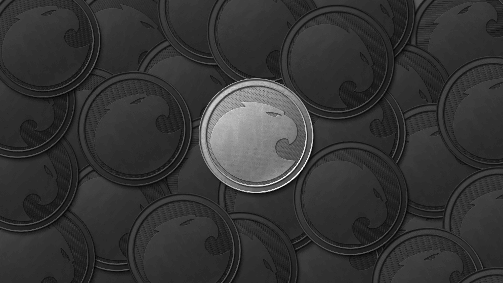

# Aragon Network Token [](https://travis-ci.org/aragon/aragon-network-token) 



Important resources:
- If integrating ANT in an exchange or automated system, please read: [A note for exchanges or holders interacting with ANT in an automated manner](https://blog.aragon.one/a-note-for-exchanges-or-holders-interacting-with-ant-in-an-automated-manner-fe13152c1b36)
- [Presale allocation details](/PRESALE.md)
- [Multisig structure](/MULTISIG.md)
- [Token sale flow](/SALE_FLOW.md)
- [Technical overview](https://blog.aragon.one/aragon-token-sale-technical-overview-9c2a4b910755) blogpost.

## ABIs

Sale:

```
[{"constant":true,"inputs":[],"name":"capCommitment","outputs":[{"name":"","type":"bytes32"}],"payable":false,"type":"function"},{"constant":true,"inputs":[],"name":"initialPrice","outputs":[{"name":"","type":"uint256"}],"payable":false,"type":"function"},{"constant":true,"inputs":[],"name":"finalBlock","outputs":[{"name":"","type":"uint256"}],"payable":false,"type":"function"},{"constant":false,"inputs":[],"name":"emergencyStopSale","outputs":[],"payable":false,"type":"function"},{"constant":true,"inputs":[],"name":"initialBlock","outputs":[{"name":"","type":"uint256"}],"payable":false,"type":"function"},{"constant":true,"inputs":[],"name":"communityMultisig","outputs":[{"name":"","type":"address"}],"payable":false,"type":"function"},{"constant":true,"inputs":[{"name":"_blockNumber","type":"uint256"}],"name":"stageForBlock","outputs":[{"name":"","type":"uint8"}],"payable":false,"type":"function"},{"constant":true,"inputs":[],"name":"getBlockNumber","outputs":[{"name":"","type":"uint256"}],"payable":false,"type":"function"},{"constant":true,"inputs":[],"name":"saleStopped","outputs":[{"name":"","type":"bool"}],"payable":false,"type":"function"},{"constant":false,"inputs":[{"name":"_from","type":"address"},{"name":"_to","type":"address"},{"name":"_amount","type":"uint256"}],"name":"onTransfer","outputs":[{"name":"","type":"bool"}],"payable":false,"type":"function"},{"constant":true,"inputs":[],"name":"isActivated","outputs":[{"name":"","type":"bool"}],"payable":false,"type":"function"},{"constant":true,"inputs":[],"name":"priceStages","outputs":[{"name":"","type":"uint8"}],"payable":false,"type":"function"},{"constant":false,"inputs":[{"name":"_newMultisig","type":"address"}],"name":"setCommunityMultisig","outputs":[],"payable":false,"type":"function"},{"constant":false,"inputs":[],"name":"restartSale","outputs":[],"payable":false,"type":"function"},{"constant":true,"inputs":[{"name":"","type":"address"}],"name":"activated","outputs":[{"name":"","type":"bool"}],"payable":false,"type":"function"},{"constant":true,"inputs":[],"name":"saleWallet","outputs":[{"name":"","type":"address"}],"payable":false,"type":"function"},{"constant":true,"inputs":[{"name":"_cap","type":"uint256"},{"name":"_cap_secure","type":"uint256"}],"name":"isValidCap","outputs":[{"name":"","type":"bool"}],"payable":false,"type":"function"},{"constant":false,"inputs":[{"name":"networkAddress","type":"address"}],"name":"deployNetwork","outputs":[],"payable":false,"type":"function"},{"constant":true,"inputs":[],"name":"saleFinalized","outputs":[{"name":"","type":"bool"}],"payable":false,"type":"function"},{"constant":true,"inputs":[],"name":"finalPrice","outputs":[{"name":"","type":"uint256"}],"payable":false,"type":"function"},{"constant":false,"inputs":[{"name":"_token","type":"address"},{"name":"_networkPlaceholder","type":"address"},{"name":"_saleWallet","type":"address"}],"name":"setANT","outputs":[],"payable":false,"type":"function"},{"constant":false,"inputs":[{"name":"_receiver","type":"address"},{"name":"_amount","type":"uint256"},{"name":"cliffDate","type":"uint64"},{"name":"vestingDate","type":"uint64"}],"name":"allocatePresaleTokens","outputs":[],"payable":false,"type":"function"},{"constant":true,"inputs":[{"name":"_cap","type":"uint256"},{"name":"_cap_secure","type":"uint256"}],"name":"computeCap","outputs":[{"name":"","type":"bytes32"}],"payable":false,"type":"function"},{"constant":false,"inputs":[],"name":"activateSale","outputs":[],"payable":false,"type":"function"},{"constant":true,"inputs":[],"name":"aragonDevMultisig","outputs":[{"name":"","type":"address"}],"payable":false,"type":"function"},{"constant":true,"inputs":[{"name":"_stage","type":"uint8"}],"name":"priceForStage","outputs":[{"name":"","type":"uint256"}],"payable":false,"type":"function"},{"constant":false,"inputs":[{"name":"_cap","type":"uint256"},{"name":"_cap_secure","type":"uint256"}],"name":"finalizeSale","outputs":[],"payable":false,"type":"function"},{"constant":false,"inputs":[{"name":"_newMultisig","type":"address"}],"name":"setAragonDevMultisig","outputs":[],"payable":false,"type":"function"},{"constant":false,"inputs":[{"name":"_owner","type":"address"},{"name":"_spender","type":"address"},{"name":"_amount","type":"uint256"}],"name":"onApprove","outputs":[{"name":"","type":"bool"}],"payable":false,"type":"function"},{"constant":true,"inputs":[],"name":"networkPlaceholder","outputs":[{"name":"","type":"address"}],"payable":false,"type":"function"},{"constant":true,"inputs":[],"name":"totalCollected","outputs":[{"name":"","type":"uint256"}],"payable":false,"type":"function"},{"constant":false,"inputs":[{"name":"_cap","type":"uint256"},{"name":"_cap_secure","type":"uint256"}],"name":"revealCap","outputs":[],"payable":false,"type":"function"},{"constant":true,"inputs":[{"name":"_blockNumber","type":"uint256"}],"name":"getPrice","outputs":[{"name":"","type":"uint256"}],"payable":false,"type":"function"},{"constant":false,"inputs":[{"name":"_owner","type":"address"}],"name":"proxyPayment","outputs":[{"name":"","type":"bool"}],"payable":true,"type":"function"},{"constant":true,"inputs":[],"name":"dust","outputs":[{"name":"","type":"uint256"}],"payable":false,"type":"function"},{"constant":true,"inputs":[],"name":"hardCap","outputs":[{"name":"","type":"uint256"}],"payable":false,"type":"function"},{"constant":true,"inputs":[],"name":"token","outputs":[{"name":"","type":"address"}],"payable":false,"type":"function"},{"inputs":[{"name":"_initialBlock","type":"uint256"},{"name":"_finalBlock","type":"uint256"},{"name":"_aragonDevMultisig","type":"address"},{"name":"_communityMultisig","type":"address"},{"name":"_initialPrice","type":"uint256"},{"name":"_finalPrice","type":"uint256"},{"name":"_priceStages","type":"uint8"},{"name":"_capCommitment","type":"bytes32"}],"payable":false,"type":"constructor"},{"payable":true,"type":"fallback"},{"anonymous":false,"inputs":[{"indexed":true,"name":"holder","type":"address"},{"indexed":false,"name":"antAmount","type":"uint256"}],"name":"NewPresaleAllocation","type":"event"},{"anonymous":false,"inputs":[{"indexed":true,"name":"holder","type":"address"},{"indexed":false,"name":"antAmount","type":"uint256"},{"indexed":false,"name":"etherAmount","type":"uint256"}],"name":"NewBuyer","type":"event"},{"anonymous":false,"inputs":[{"indexed":false,"name":"value","type":"uint256"},{"indexed":false,"name":"secret","type":"uint256"},{"indexed":false,"name":"revealer","type":"address"}],"name":"CapRevealed","type":"event"}]
```


ANT:

```
[{"constant":false,"inputs":[{"name":"_to","type":"address"},{"name":"_value","type":"uint256"},{"name":"_start","type":"uint64"},{"name":"_cliff","type":"uint64"},{"name":"_vesting","type":"uint64"}],"name":"grantVestedTokens","outputs":[],"payable":false,"type":"function"},{"constant":true,"inputs":[{"name":"_holder","type":"address"}],"name":"tokenGrantsCount","outputs":[{"name":"index","type":"uint256"}],"payable":false,"type":"function"},{"constant":true,"inputs":[],"name":"name","outputs":[{"name":"","type":"string"}],"payable":false,"type":"function"},{"constant":false,"inputs":[{"name":"_spender","type":"address"},{"name":"_amount","type":"uint256"}],"name":"approve","outputs":[{"name":"success","type":"bool"}],"payable":false,"type":"function"},{"constant":true,"inputs":[{"name":"_holder","type":"address"}],"name":"spendableBalanceOf","outputs":[{"name":"","type":"uint256"}],"payable":false,"type":"function"},{"constant":true,"inputs":[],"name":"creationBlock","outputs":[{"name":"","type":"uint256"}],"payable":false,"type":"function"},{"constant":true,"inputs":[],"name":"totalSupply","outputs":[{"name":"","type":"uint256"}],"payable":false,"type":"function"},{"constant":false,"inputs":[{"name":"_addr","type":"address"},{"name":"_allowed","type":"bool"}],"name":"setCanCreateGrants","outputs":[],"payable":false,"type":"function"},{"constant":false,"inputs":[{"name":"_from","type":"address"},{"name":"_to","type":"address"},{"name":"_value","type":"uint256"}],"name":"transferFrom","outputs":[{"name":"success","type":"bool"}],"payable":false,"type":"function"},{"constant":true,"inputs":[{"name":"","type":"address"},{"name":"","type":"uint256"}],"name":"grants","outputs":[{"name":"granter","type":"address"},{"name":"value","type":"uint256"},{"name":"cliff","type":"uint64"},{"name":"vesting","type":"uint64"},{"name":"start","type":"uint64"}],"payable":false,"type":"function"},{"constant":true,"inputs":[],"name":"decimals","outputs":[{"name":"","type":"uint8"}],"payable":false,"type":"function"},{"constant":false,"inputs":[{"name":"_newController","type":"address"}],"name":"changeController","outputs":[],"payable":false,"type":"function"},{"constant":true,"inputs":[{"name":"_owner","type":"address"},{"name":"_blockNumber","type":"uint256"}],"name":"balanceOfAt","outputs":[{"name":"","type":"uint256"}],"payable":false,"type":"function"},{"constant":true,"inputs":[],"name":"version","outputs":[{"name":"","type":"string"}],"payable":false,"type":"function"},{"constant":true,"inputs":[{"name":"_holder","type":"address"},{"name":"_grantId","type":"uint256"}],"name":"tokenGrant","outputs":[{"name":"granter","type":"address"},{"name":"value","type":"uint256"},{"name":"vested","type":"uint256"},{"name":"start","type":"uint64"},{"name":"cliff","type":"uint64"},{"name":"vesting","type":"uint64"}],"payable":false,"type":"function"},{"constant":false,"inputs":[{"name":"_cloneTokenName","type":"string"},{"name":"_cloneDecimalUnits","type":"uint8"},{"name":"_cloneTokenSymbol","type":"string"},{"name":"_snapshotBlock","type":"uint256"},{"name":"_transfersEnabled","type":"bool"}],"name":"createCloneToken","outputs":[{"name":"","type":"address"}],"payable":false,"type":"function"},{"constant":true,"inputs":[{"name":"holder","type":"address"}],"name":"lastTokenIsTransferableDate","outputs":[{"name":"date","type":"uint64"}],"payable":false,"type":"function"},{"constant":true,"inputs":[{"name":"_owner","type":"address"}],"name":"balanceOf","outputs":[{"name":"balance","type":"uint256"}],"payable":false,"type":"function"},{"constant":true,"inputs":[],"name":"parentToken","outputs":[{"name":"","type":"address"}],"payable":false,"type":"function"},{"constant":false,"inputs":[{"name":"_owner","type":"address"},{"name":"_amount","type":"uint256"}],"name":"generateTokens","outputs":[{"name":"","type":"bool"}],"payable":false,"type":"function"},{"constant":true,"inputs":[],"name":"symbol","outputs":[{"name":"","type":"string"}],"payable":false,"type":"function"},{"constant":true,"inputs":[{"name":"_blockNumber","type":"uint256"}],"name":"totalSupplyAt","outputs":[{"name":"","type":"uint256"}],"payable":false,"type":"function"},{"constant":false,"inputs":[{"name":"_to","type":"address"},{"name":"_value","type":"uint256"}],"name":"transfer","outputs":[{"name":"success","type":"bool"}],"payable":false,"type":"function"},{"constant":true,"inputs":[],"name":"transfersEnabled","outputs":[{"name":"","type":"bool"}],"payable":false,"type":"function"},{"constant":true,"inputs":[],"name":"parentSnapShotBlock","outputs":[{"name":"","type":"uint256"}],"payable":false,"type":"function"},{"constant":false,"inputs":[{"name":"_spender","type":"address"},{"name":"_amount","type":"uint256"},{"name":"_extraData","type":"bytes"}],"name":"approveAndCall","outputs":[{"name":"success","type":"bool"}],"payable":false,"type":"function"},{"constant":true,"inputs":[{"name":"holder","type":"address"},{"name":"time","type":"uint64"}],"name":"transferableTokens","outputs":[{"name":"","type":"uint256"}],"payable":false,"type":"function"},{"constant":false,"inputs":[{"name":"_owner","type":"address"},{"name":"_amount","type":"uint256"}],"name":"destroyTokens","outputs":[{"name":"","type":"bool"}],"payable":false,"type":"function"},{"constant":true,"inputs":[{"name":"_owner","type":"address"},{"name":"_spender","type":"address"}],"name":"allowance","outputs":[{"name":"remaining","type":"uint256"}],"payable":false,"type":"function"},{"constant":true,"inputs":[],"name":"tokenFactory","outputs":[{"name":"","type":"address"}],"payable":false,"type":"function"},{"constant":false,"inputs":[{"name":"_holder","type":"address"},{"name":"_grantId","type":"uint256"}],"name":"revokeTokenGrant","outputs":[],"payable":false,"type":"function"},{"constant":false,"inputs":[{"name":"_transfersEnabled","type":"bool"}],"name":"enableTransfers","outputs":[],"payable":false,"type":"function"},{"constant":true,"inputs":[],"name":"controller","outputs":[{"name":"","type":"address"}],"payable":false,"type":"function"},{"constant":false,"inputs":[{"name":"_newWhitelister","type":"address"}],"name":"changeVestingWhitelister","outputs":[],"payable":false,"type":"function"},{"inputs":[{"name":"_tokenFactory","type":"address"}],"payable":false,"type":"constructor"},{"payable":true,"type":"fallback"},{"anonymous":false,"inputs":[{"indexed":true,"name":"from","type":"address"},{"indexed":true,"name":"to","type":"address"},{"indexed":false,"name":"value","type":"uint256"},{"indexed":false,"name":"start","type":"uint64"},{"indexed":false,"name":"cliff","type":"uint64"},{"indexed":false,"name":"vesting","type":"uint64"}],"name":"NewTokenGrant","type":"event"},{"anonymous":false,"inputs":[{"indexed":true,"name":"_cloneToken","type":"address"},{"indexed":false,"name":"_snapshotBlock","type":"uint256"}],"name":"NewCloneToken","type":"event"},{"anonymous":false,"inputs":[{"indexed":true,"name":"from","type":"address"},{"indexed":true,"name":"to","type":"address"},{"indexed":false,"name":"value","type":"uint256"}],"name":"Transfer","type":"event"},{"anonymous":false,"inputs":[{"indexed":true,"name":"owner","type":"address"},{"indexed":true,"name":"spender","type":"address"},{"indexed":false,"name":"value","type":"uint256"}],"name":"Approval","type":"event"}]
```

MultiSig:

```
[{"constant":true,"inputs":[{"name":"","type":"uint256"}],"name":"owners","outputs":[{"name":"","type":"address"}],"payable":false,"type":"function"},{"constant":false,"inputs":[{"name":"owner","type":"address"}],"name":"removeOwner","outputs":[],"payable":false,"type":"function"},{"constant":false,"inputs":[{"name":"transactionId","type":"uint256"}],"name":"revokeConfirmation","outputs":[],"payable":false,"type":"function"},{"constant":true,"inputs":[{"name":"","type":"address"}],"name":"isOwner","outputs":[{"name":"","type":"bool"}],"payable":false,"type":"function"},{"constant":true,"inputs":[{"name":"","type":"uint256"},{"name":"","type":"address"}],"name":"confirmations","outputs":[{"name":"","type":"bool"}],"payable":false,"type":"function"},{"constant":true,"inputs":[{"name":"pending","type":"bool"},{"name":"executed","type":"bool"}],"name":"getTransactionCount","outputs":[{"name":"count","type":"uint256"}],"payable":false,"type":"function"},{"constant":false,"inputs":[{"name":"owner","type":"address"}],"name":"addOwner","outputs":[],"payable":false,"type":"function"},{"constant":true,"inputs":[{"name":"transactionId","type":"uint256"}],"name":"isConfirmed","outputs":[{"name":"","type":"bool"}],"payable":false,"type":"function"},{"constant":true,"inputs":[{"name":"transactionId","type":"uint256"}],"name":"getConfirmationCount","outputs":[{"name":"count","type":"uint256"}],"payable":false,"type":"function"},{"constant":true,"inputs":[{"name":"","type":"uint256"}],"name":"transactions","outputs":[{"name":"destination","type":"address"},{"name":"value","type":"uint256"},{"name":"data","type":"bytes"},{"name":"executed","type":"bool"}],"payable":false,"type":"function"},{"constant":true,"inputs":[],"name":"getOwners","outputs":[{"name":"","type":"address[]"}],"payable":false,"type":"function"},{"constant":true,"inputs":[{"name":"from","type":"uint256"},{"name":"to","type":"uint256"},{"name":"pending","type":"bool"},{"name":"executed","type":"bool"}],"name":"getTransactionIds","outputs":[{"name":"_transactionIds","type":"uint256[]"}],"payable":false,"type":"function"},{"constant":true,"inputs":[{"name":"transactionId","type":"uint256"}],"name":"getConfirmations","outputs":[{"name":"_confirmations","type":"address[]"}],"payable":false,"type":"function"},{"constant":true,"inputs":[],"name":"transactionCount","outputs":[{"name":"","type":"uint256"}],"payable":false,"type":"function"},{"constant":false,"inputs":[{"name":"_required","type":"uint256"}],"name":"changeRequirement","outputs":[],"payable":false,"type":"function"},{"constant":false,"inputs":[{"name":"transactionId","type":"uint256"}],"name":"confirmTransaction","outputs":[],"payable":false,"type":"function"},{"constant":false,"inputs":[{"name":"destination","type":"address"},{"name":"value","type":"uint256"},{"name":"data","type":"bytes"}],"name":"submitTransaction","outputs":[{"name":"transactionId","type":"uint256"}],"payable":false,"type":"function"},{"constant":true,"inputs":[],"name":"MAX_OWNER_COUNT","outputs":[{"name":"","type":"uint256"}],"payable":false,"type":"function"},{"constant":true,"inputs":[],"name":"required","outputs":[{"name":"","type":"uint256"}],"payable":false,"type":"function"},{"constant":false,"inputs":[{"name":"owner","type":"address"},{"name":"newOwner","type":"address"}],"name":"replaceOwner","outputs":[],"payable":false,"type":"function"},{"constant":false,"inputs":[{"name":"transactionId","type":"uint256"}],"name":"executeTransaction","outputs":[],"payable":false,"type":"function"},{"inputs":[{"name":"_owners","type":"address[]"},{"name":"_required","type":"uint256"}],"payable":false,"type":"constructor"},{"payable":true,"type":"fallback"},{"anonymous":false,"inputs":[{"indexed":true,"name":"sender","type":"address"},{"indexed":true,"name":"transactionId","type":"uint256"}],"name":"Confirmation","type":"event"},{"anonymous":false,"inputs":[{"indexed":true,"name":"sender","type":"address"},{"indexed":true,"name":"transactionId","type":"uint256"}],"name":"Revocation","type":"event"},{"anonymous":false,"inputs":[{"indexed":true,"name":"transactionId","type":"uint256"}],"name":"Submission","type":"event"},{"anonymous":false,"inputs":[{"indexed":true,"name":"transactionId","type":"uint256"}],"name":"Execution","type":"event"},{"anonymous":false,"inputs":[{"indexed":true,"name":"transactionId","type":"uint256"}],"name":"ExecutionFailure","type":"event"},{"anonymous":false,"inputs":[{"indexed":true,"name":"sender","type":"address"},{"indexed":false,"name":"value","type":"uint256"}],"name":"Deposit","type":"event"},{"anonymous":false,"inputs":[{"indexed":true,"name":"owner","type":"address"}],"name":"OwnerAddition","type":"event"},{"anonymous":false,"inputs":[{"indexed":true,"name":"owner","type":"address"}],"name":"OwnerRemoval","type":"event"},{"anonymous":false,"inputs":[{"indexed":false,"name":"required","type":"uint256"}],"name":"RequirementChange","type":"event"}]
```

## Technical definition

At the technical level ANT is a ERC20-compliant token, derived from the [MiniMe Token](https://github.com/Giveth/minime) that allows for token cloning (forking), which will be useful for many future usecases.

Also built in the token is a vesting schedule for limiting ANT transferability over time. Aragon Project founders, advisors, early contributors and presale partners all have vesting in their tokens.

ANT is slightly diverges with the ERC20 standard, on invalid token transactions or approvals it throws instead of returning false.

## Contracts

Token:

- [ANT.sol](/contracts/ANT.sol): Main contract for the token. Derives MiniMeIrrevocableVestedToken.
- [MiniMeIrrevocableVestedToken.sol](/contracts/MiniMeIrrevocableVestedToken.sol): Adds vesting to MiniMeToken. Derives MiniMeToken.
- [MiniMeToken.sol](/contracts/MiniMeToken.sol): Token implementation.

Sale:

- [AragonTokenSale.sol](/contracts/AragonTokenSale.sol): Implementation of the initial distribution of ANT.
- [ANPlaceholder.sol](/contracts/ANPlaceholder.sol): Placeholder for the Aragon Network before its deployment.
- [SaleWallet.sol](/contracts/SaleWallet.sol): Simple contract that will hold all funds until final block of the sale.
- [MultisigWallet.sol](/contracts/MultisigWallet.sol): Gnosis multisig used for Aragon and community multisigs.

## Reviewers and audits

Code for the ANT token and the sale has been reviewed by:

- Jorge Izquierdo, Aragon (author).
- Jordi Baylina, MiniMe author. [Pending audit results](/)
- Piper Merriam, MiniMe author. [Pending audit results](/)

A bug bounty for the ANT token and sale started on [pending date]. More details.
