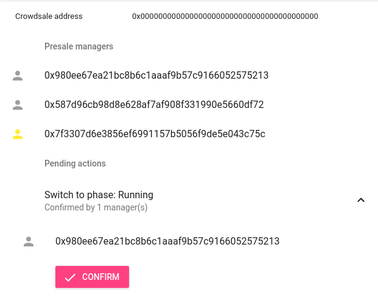
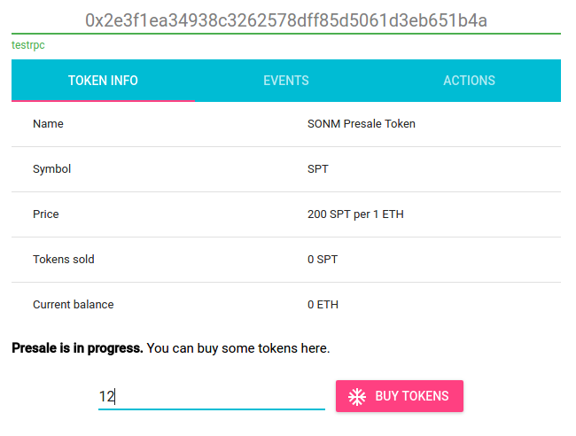

During its lifetime, presale contract passes through several *phases*. Each
phase determines which functions can be called on the contract. Token managers
are able to switch phases according to rules described below.

Switching phases and calling administrative functions is possible only by
joint decision of token managers.


Phases
------

There are five phases:
  - **Created**. Contract is just created and investors are not yet able to
    buy tokens. Token managers can start presale.
  - **Running**. Investors can buy tokens (until presale limit is reached).
    Token managers are able to temporarily pause presale or switch to
    migration phase.
  - **Paused**. Investors can't buy tokens. Token managers can resume presale
    or switch to migration phase.
  - **Migrating**. Presale is over, investors can't buy tokens but can
    exchange their presale tokens for real tokens via the crowdsale contract.
  - **Migrated**. Presale contract automatically switches to this phase when
    all tokes are successfully migrated. At this phase presale is totally
    finished.


Management Functions
--------------------

  - `tokenWithdrawEther`. This function moves all collected Ether to token
    manager's multisig account. The function can be called at any presale
    phase any number of times.
  - `tokenSetPresalePhase`. Allows to switch presale phases. Only specific
    phase transitions that comply to this state diagram are allowed:


```
                  +-----------+
                  |           |
               +-->  Running  +---------+
               |  |           |         |
+-----------+  |  +--+----^---+  +------v-------+     +-----------+
|           |  |     |    |      |              |     |           |
|  Created  +--+     |    |      |  Migrating   +-----> Migrated  |
|           |        |    |      |              |     |           |
+-----------+        |    |      +------^-------+     +-----------+
                  +--v----+---+         |
                  |           |         |
                  |  Paused   +---------+
                  |           |
                  +-----------+
```

  - `tokenSetCrowdsaleManager`. This function allows to set crowdsale manager
    contract address. Crowdsale manager is responsible for migrating presale
    tokens and has exclusive rights to burn presale tokens after migration.
    Valid crowdsale manager address is required to switch to *Migrating*
    phase. It is not possible to change crowdsale manager address when
    migration is in progress.

Contracts
---------
There are two contracts involved in presale process:

  - `PresaleToken`: holds registry of investors and their token balances,
    also acts as a temporary storage for gathered ETH.
  - `TokenManager`:  standard multisig wallet with extra functions to control
    presale process.

For testing purposes those contracts are deployed on test networks:

  - Ropsten:
    - PresaleToken: [0x5e27967f8fb05ec1a76ed1ecb0b57cced6f2cba8](https://testnet.etherscan.io/address/0x5e27967f8fb05ec1a76ed1ecb0b57cced6f2cba8)
    - TokenManager: [0xe51fc42848679fb21b7adfea4d5162b4f6fd3878](https://testnet.etherscan.io/address/0xe51fc42848679fb21b7adfea4d5162b4f6fd3878)
  - Kovan:
    - PresaleToken: [0x3000162dccb71e830cb1c2c6ed116b12aa4d9355](https://kovan.etherscan.io/address/0x3000162dccb71e830cb1c2c6ed116b12aa4d9355)
    - TokenManager: [0xacd96b2cd2c00f5d67baca0d2b7e094ee945c7a3](https://kovan.etherscan.io/address/0xacd96b2cd2c00f5d67baca0d2b7e094ee945c7a3)

`TokenManager` contract implementation is based on the [multisig wallet by
Gnosis](https://blog.gnosis.pm/release-of-new-multisig-wallet-59b6811f7edc),
it is used to collectively manage ETH funds and allows withdrawals,
adding/removing owners, and sending custom transactions. There is web-based UI
to interact with it: https://wallet.gnosis.pm.

The deployed `TokenManager` contracts are configured each with 3 manager
addresses and require 2 confirmations to run transactions:

  - Manager addresses on Ropsten
    -  [0xFB4083E4B305D1de4b6cd61AA29454f7AD1fE7b8](https://testnet.etherscan.io/address/0xFB4083E4B305D1de4b6cd61AA29454f7AD1fE7b8)
    - [0xC6dD8CAC3709A46Fcfb62F8e8639985864d339d8](https://testnet.etherscan.io/address/0xC6dD8CAC3709A46Fcfb62F8e8639985864d339d8)
    - [0x00b7151a4C21E5B09543c070a45Df19873A67A45](https://testnet.etherscan.io/address/0x00b7151a4C21E5B09543c070a45Df19873A67A45)
  - Manager addresses on Kovan
    - [0x980ee67ea21bc8b6c1aaaf9b57c9166052575213](https://kovan.etherscan.io/address/0x980ee67ea21bc8b6c1aaaf9b57c9166052575213)
      - Private Key: `f099584c9fa50e8367b9dd9cb2a7c40cda9d8883b9571c1122cb43bdb7530013`
    - [0x587d96cb98d8e628af7af908f331990e5660df72](https://kovan.etherscan.io/address/0x587d96cb98d8e628af7af908f331990e5660df72)
      - Private Key: `0dee03c50b135c5649f15b373f1b52b160d11954ede41c117999b446a3d146b0`
    - [0x7f3307d6e3856ef6991157b5056f9de5e043c75c](https://kovan.etherscan.io/address/0x7f3307d6e3856ef6991157b5056f9de5e043c75c)
      - Private Key: `5efb179d282e88f724b160609ccb9a8127761ffbc1ebfcfa83c2344257ea2546`

All those addresses are preloaded with some ether for testing purposes.


Presale Administration
----------------------

`TokenManager` contract adds three new functions to the multisig. Those
functions allow to withdraw ETH funds from the `PresaleToken`, switch presale
phase, and set crowdsale contract address. There is web-based UI to simplify
executing administrative functions: https://sonm-io.github.io/token. In the
following we will see how to use it.

By default, `PresaleToken` conrtact does not allow to buy tokens. Presale team
can enable buying by switching `PresaleToken` to "Running" phase.

On the "Actions" tab you can see "Available actions" section. (If this is not
the case, select registered multisig account in your Web3 provider and refresh).


Press "Start Presale" button, confirm transaction, then wait for the
transaction to be mined, and refresh the page (if required). Now you will see
new action in "Pending actions" section.

Anoter member of the team can see pending action and confirm it.



After two confirmations the action will be executed and token buying will be
enabled. You can switch to "Token Info" and see "Buy tokens" button.



Other actions like pause / resume / withdraw can be executed in the same way.
